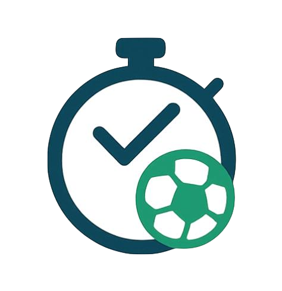

#   Sport Scheduler - Web

**Sport Scheduler** is a lightweight web application that makes it easy to **find, track, and schedule sports games**.
Users can search across leagues, teams, and countries, preview upcoming fixtures, and export games directly into their calendar (Google Calendar or `.ics` file).

👉 Try it live: [sport-scheduler.com](https://sport-scheduler.com)

---

## ✨ Features

* 🔍 **Smart Search** — Search for games, leagues, teams, or countries with instant results.
* 📅 **Game Cards** — Clean, responsive cards showing game info (teams, league, date, round).
* 📌 **Filters & Sections** — Organize results by countries, leagues, or teams.
* ⏰ **Date Highlights** — Visual cues for games happening today or within the next week.
* 📤 **Export Options**

  * Add selected games to Google Calendar - in development.
  * Download an `.ics` file to import into any calendar app.
* 📱 **Responsive UI** — Works on desktop (mobile design in progress).

---

## 🛠️ Tech Stack

* **Frontend:** React + TypeScript + TailwindCSS
* **Backend:** Node.js + Express
* **Database:** MongoDB (teams, countries, leagues, fixtures)
* **Deployment:** VPS (Dockerized services)

---

## 🚀 Getting Started (For Developers)

1. Clone the repository:

   ```bash
   git clone https://github.com/your-username/sport-scheduler.git
   cd sport-scheduler-web
   ```

2. Install dependencies:

   ```bash
   npm install
   ```

3. Start the development server (dev-nd - without downloading logos)

   ```bash
   npm run dev-nd
   ```

5. Backend runs separately (Node + MongoDB), see sports-scheduler-be repo

   
---

## 📊 Data

* Games are scraped and updated weekly.
* Entities are stored in MongoDB collections:

  * `countries`
  * `leagues`
  * `teams`
  * `fixtures`

---

## 📌 Roadmap

* ✅ Search by team, league, country
* ✅ Export to ics files
* 🔄 Export and integrate Google Calendar
* 🔒 User accounts & authentication
* 📱 Mobile-first design & PWA support
* 💡 Recommendations based on favorite teams

---

## 🤝 Contributing

Contributions, ideas, and bug reports are welcome!
Open an issue or submit a pull request.

---
